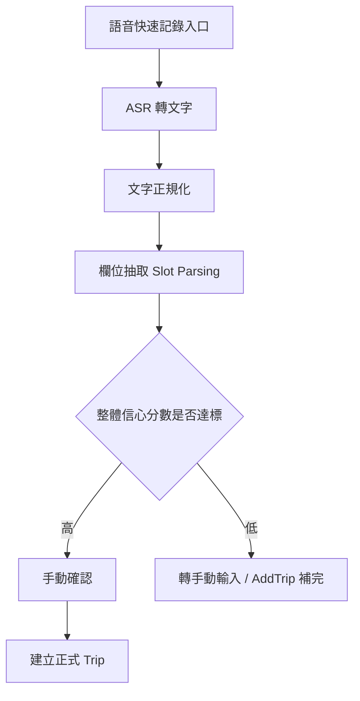
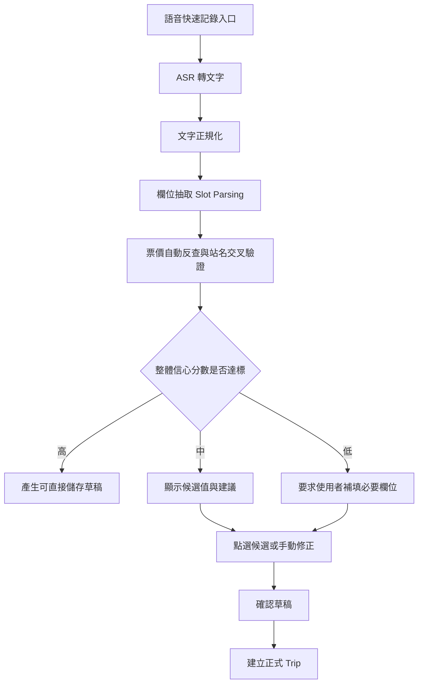

# TPASS.calc 語音快速記錄行程規劃

## 1. 目標與範圍

### 核心目標
- 讓使用者用語音快速新增行程，降低手動輸入負擔。
- 即使說法不一致（口語、同義詞、站名別稱），仍可穩定解析為可儲存欄位。
- 語音輸入流程獨立於新增行程頁，不綁定 AddTrip 畫面。
- 對不確定內容提供候選與補填，不強迫一次到位。
- 先提升任務成功率，再追求逐字準確率。

### 版本範圍
- **V1（低風險）**：建立獨立語音入口（位於triplistview，手動新增紀錄按鈕旁）、基本欄位解析。**明確限定為「單趟行程記錄」**，暫不處理複雜連環轉乘。
- **V2（高價值）**：語音解析結構化行程欄位（運具、起點、終點、價格、時間、路線）+ 票價自動反查 + 不確定欄位候選補填。
- **V3（持續優化）**：加入自學習詞典與個人化修正建議。

### 版本邊界
- **V1 僅包含**：獨立入口、語音轉寫、單趟句子解析、草稿儲存、手動確認後建立 Trip。
- **V2 才包含**：自動票價反查、候選欄位 chips、站名/時間高階正規化、低信心欄位補填元件、與 AddTrip 的補完串接。
- 若某功能會讓使用者「可以少填欄位」，但仍需要人工確認，原則上歸類到 V2。

---

## 2. 架構方向

採用「語音辨識 + 領域解析」雙層架構，不直接依賴大型模型端到端輸出。

入口設計：
- 新增獨立頁面「語音快速記錄」，由主介面直接進入。
- 不在 AddTrip 內嵌主流程，避免耦合與畫面複雜度上升。
- AddTrip 僅作為最後補完與人工修正 fallback。

1. **Speech Layer**
- 使用 iOS 原生 `SFSpeechRecognizer` 取得轉文字結果。
- 僅負責聽寫，不做業務判斷。

2. **Domain NLP Layer**
- 文字正規化（清理口語噪音、同義詞映射、數字與時間轉換）。
- 欄位抽取（運具、起迄站、價格、路線、時間、備註）。
- 站名與票價資料交叉驗證。
- 產生信心分數，決定是否可直接儲存。

3. **UX Confirmation Layer**
- 顯示解析結果卡片，低信心欄位高亮提示。
- 使用者可一鍵確認、局部修正、或改手動。

4. **Voice Draft Layer（獨立草稿層）**
- 將語音解析結果先保存成草稿，不直接落地成 Trip。
- 草稿包含 parsed 欄位、信心分數、原始轉寫、使用者修正紀錄。
- 使用者確認後才轉成正式 Trip。

---

## 3. 欄位解析定義

### 欄位 Schema
- `transportType`：mrt, bus, coach, tra, tymrt, tcmrt, kmrt, hsr, lrt, bike, ferry
- `startStation`：起點站名
- `endStation`：終點站名
- `price`：整數金額
- `routeId`：路線編號（常見於公車/客運）
- `date`：乘車日期（若未提及，預設當下）
- `time`：乘車時間（若未提及，預設當下）
- `note`：備註文字
- `isTransfer`：是否轉乘（V1 固定為 false）

### 預設規則
- **票價自動反查 (Auto-Fare)**：若精準辨識出「起迄站」與「運具」，且使用者未說出金額，系統應自動呼叫底層 FareService 帶入 `price`，並將 priceScore 設為最高。
- **票價反查失敗處理**：若 FareService 查無結果，`price` 維持 `null`，不得自動填 0；介面需顯示「票價查無結果，請手動輸入」並將此欄位標為待確認。
- **票價不確定情境**：若同一運具可能有多種票種/優惠而資料源無法可靠區分，優先不自動填值，改由使用者確認。
- **時間預設機制**：語音紀錄常為事後補記。若偵測到相對時間詞彙，需轉換為實際 Date/Time。
- **時間確認機制**：當語句未出現明確日期/時間，且系統只能以「當下時間」補值時，UI 必須顯示「使用目前時間？」的確認提示；若是事後補記，使用者可一鍵改成今天/昨天/自訂時間。
- **轉乘防呆**：V1 僅支援單趟。任何包含兩組以上「起點 -> 終點」關係的語句，都視為潛在轉乘或多段行程，預設不直接合併；需提示「目前僅支援單趟辨識，請拆成兩筆紀錄」。
- 若只辨識到文字敘述但欄位不完整，保留在 note，提示補齊。
- 若起迄站任一欄位信心不足，不允許直接儲存。
- 若欄位信心中等，提供 Top N 候選供點選，並保留手填入口。

---

## 4. 語意正規化規則表

### 4.1 字元與格式清理
- 移除頭尾空白、連續空格、全形空白。
- 統一全半形符號（例如 ：、:、-、－）。
- 數字正規化：三十、三零七、307 號、307路 -> 307 / 十五塊、15 元 -> 15

### 4.2 運具同義詞映射（包含中英混雜防呆）
- 捷運、地鐵、MRT -> mrt
- 機捷、桃捷 -> tymrt
- 高鐵、HSR -> hsr
- 台鐵、火車 -> tra
- 公車、巴士 -> bus
- 客運、國道客運 -> coach
- 腳踏車、Ubike、YouBike、優拜 -> bike

### 4.3 站名同義詞映射（示意）
- 北車 -> 台北車站
- 桃園高鐵站 -> 高鐵桃園站
- 台北車站站內 -> 台北車站

### 4.4 備註/目的地語意補充（非站名）
- 若語句中出現品牌、地標、商場等非站名詞彙（例如 Costco），不應放入站名別名表。
- 這類詞彙應優先進入 `note`，或在使用者選擇「目的地備註」時作為附加文字。
- 若未來要支援地標解析，應另建 `landmark_aliases.json`，避免污染站名字典。

### 4.5 時間與日期規則（示意）
- 昨天、尋日 -> Date() 減 1 天
- 前天 -> Date() 減 2 天
- 早上 -> 預設 08:00
- 下午 -> 預設 14:00

---

## 5. 解析流程

### V1 流程圖

V1 原則：
- 只保留「高信心 -> 確認 -> 建立」與「低信心 -> 轉手動」兩條路徑。
- 不顯示候選 chips，不要求欄位補填流程在語音頁完成。

### V2 流程圖

V2 原則：
- 允許候選 chips 與手動補填。
- `price`、`startStation`、`endStation`、`time` 可由解析器先推斷，再由使用者確認。

---

## 6. 信心分數策略

### 欄位分數
- `stationScore`：站名匹配分數（精準匹配 > 別名匹配 > 模糊匹配）。
- `transportScore`：運具詞命中分數。
- `priceScore`：金額格式可信度（自動反查成功 = 1.0）。
- `timeScore`：時間解析可信度。
- `consistencyScore`：跨欄位一致性（例如運具與站名資料源對得上）。

### 決策門檻（建議初值）
- `overallScore >= 0.85`：可直接儲存（仍顯示可撤銷提示）。
- `0.65 <= overallScore < 0.85`：顯示確認卡片，需使用者點確認。
- `overallScore < 0.65`：回退手動輸入，並保留語音文字於備註草稿。

### overallScore 公式（V1）
- `overallScore_V1 = 0.40 * stationScore + 0.25 * transportScore + 0.20 * timeScore + 0.15 * consistencyScore`
- V1 不納入 `priceScore`，因為 V1 不做自動票價反查。
- 若起點或終點任一欄位低於 `0.60`，則整體 `overallScore_V1` 直接上限封頂為 `0.79`，避免低信心站名被整體平均沖高。
- 若任一必要欄位為 `null`，整體狀態視為「不可直接建立」，需轉手動輸入。

### overallScore 公式（V2）
- `overallScore_V2 = 0.35 * stationScore + 0.20 * transportScore + 0.20 * priceScore + 0.15 * timeScore + 0.10 * consistencyScore`
- V2 才納入 `priceScore`，且自動反查成功時 `priceScore = 1.0`。
- 若起點或終點任一欄位低於 `0.60`，則整體 `overallScore_V2` 直接上限封頂為 `0.79`。
- 若任一必要欄位為 `null` 且未進入補填流程，整體狀態視為「不可直接建立」。
- 若偵測到多段行程或轉乘意圖，`overallScore` 只作為草稿排序依據，不可直接建立 Trip。

---

## 7. 與現有資料能力整合

可直接重用既有能力，降低實作成本：
- 各運具站名正規化能力（如 MRT、TYMRT、HSR、LRT 等）。
- 既有票價查詢服務 (`TPEMRTFareService` 等)，用來做起迄站合理性驗證與自動帶入金額。
- 既有新增行程頁可作 fallback 編輯器，不作主入口。
- 新增 `VoiceDraft` 模型作為語音流程與 Trip 的中介層。

---

## 8. UX 設計建議

### 互動模式與觸覺回饋 (Haptics)
- **視覺與操作**：點擊麥克風開始，點擊停止。顯示即時聽寫文字與狀態（聆聽中、解析中、可儲存、需確認）。
- **觸覺回饋**：
  - 點擊開始錄音時：輕震動 (`UIImpactFeedbackGenerator(style: .light)`)。
  - 解析出高信心草稿/儲存成功時：成功震動 (`UINotificationFeedbackGenerator().notificationOccurred(.success)`)。
  - 解析失敗/低信心需手動補填時：警告震動 (`.warning`)。

### 低信心提示
- 起點/終點欄位旁顯示黃色警示點。
- 顯示候選站名 Top 3 供一鍵選擇。
- 解析不確定時，欄位右側顯示「請確認」標籤與手填按鈕。

### 候選與補填流程
- 每個不確定欄位顯示：候選 chips + 手動輸入欄。
- 站名候選來源：同義詞映射 + 站名字典模糊匹配 + 區域/運具過濾。
- 價格候選來源：語音數字抽取 + 票價服務推算值。
- 允許「先存草稿，稍後補完」。

### 草稿管理流程
- 草稿入口：
  - 語音快速記錄完成後的「待確認草稿」頁。
  - 主頁或設定頁的「語音草稿」快捷入口。
- 草稿狀態：`draft`、`needs_review`、`ready_to_save`、`expired`。
- 草稿過期：預設 7 天後標記 `expired`，但不自動刪除；`expired` 草稿仍保留供使用者手動刪除或重新開啟。
- 草稿通知：若存在 `needs_review` 草稿，App 可在下次啟動時顯示提醒徽章或橫幅，但不強制中斷流程。
- 草稿刪除：使用者可手動刪除草稿；刪除前需再次確認。

---

## 9. 持續優化（避免每個人說法不同造成失敗）

### 收集修正對（匿名）
- originalTranscript：原始轉寫
- parsedResult：模型解析結果
- finalUserResult：使用者最終修正結果

### 每週更新字典
- 建立 confusion pairs：(北車 -> 台北車站)
- 更新同義詞字典、站名別名字典、時間口語詞典。

---

## 10. 隱私與合規
- 預設在裝置端完成語音轉寫與解析。
- 若需上傳錯誤樣本，必須匿名化、去識別化、可選擇退出。
- 錯誤樣本（若使用者同意）僅保存 30 天，之後自動刪除。
- 語音草稿若未完成，預設保存 7 天並標記為 `expired`，不自動刪除；完成後轉為 Trip，依原本資料保留策略處理。
- 文件中明確告知語音資料用途、保存期限與刪除機制。

---

## 11. 風險與對策

- **風險一：iOS SFSpeechRecognizer 60秒限制**
  - **對策**：介面上加入倒數進度條，或在偵測到語音停頓 (Silence) 時自動結束並開始解析，避免觸發系統錯誤。
- **風險二：裝置端辨識 (On-Device) 精準度低落**
  - **對策**：`zh-TW` 在舊款 iPhone 的 on-device 辨識極差。需動態判斷：若網路暢通，優先允許依賴 Apple 伺服器解析；無網路時才強制 on-device 並降低信心分數門檻。
- **風險三：中英夾雜辨識失敗**
  - **對策**：於 `transport_synonyms.json` 中加入常見的拼音誤認字（如將「屋伯」映射至 Uber）。
- **風險四：公車路線與站名同時說出，解析衝突。**
  - **對策**：路線優先抽取，再以運具上下文限制站名候選集。
- **風險五：使用者拒絕麥克風/語音辨識權限。**
  - **對策**：提供清楚 fallback：顯示權限說明、引導開啟設定、允許繼續使用手動輸入，且不要阻斷原本的行程新增流程。

---

## 12. 最小實作清單（可直接開工）

### V1 最小實作清單
1. 新增 `VoiceInputService`（處理 iOS 語音權限、60秒限制防護、開始/停止、轉寫事件）。
2. 新增獨立頁 `VoiceQuickTripView`（主入口，包含錄音與草稿預覽）。
3. 新增 `VoiceDraft` 模型與草稿儲存機制。
4. 建立基本文字正規化與單趟句型解析。
5. 加入麥克風權限拒絕的 fallback 與引導提示。
6. 將最終確認結果轉為 Trip，但仍保留手動補完入口。

### V2 最小實作清單
1. 新增 `TripVoiceParser`（欄位抽取、時間轉換、自動票價反查、信心分數）。
2. 新增候選/補填元件 `FieldResolutionCard`。
3. 建立 JSON 詞典檔：
   - `transport_synonyms.json`
   - `station_aliases.json`
   - `numeral_patterns.json`
   - `time_synonyms.json`
4. 將草稿狀態拆分為 `draft / needs_review / ready_to_save / expired`。
5. 將最終確認結果轉為 Trip，必要時導入 AddTrip 作補完。
6. 加入埋點（成功、失敗、修正、草稿放棄率）。
7. 先灰度釋出給內部測試。

### V1/V2 共同驗收
- 若使用者拒絕麥克風權限，應導到權限說明頁或顯示「仍可手動輸入」選項。
- 若草稿未完成，應可從草稿清單回到解析頁繼續補完。
- 不可因為語音功能失敗而阻斷現有手動新增行程。

---

## 13. 第一版交付定義（Definition of Done）

符合以下條件視為 V1 可上線測試：

1. 可從獨立入口進入語音快速記錄，不依賴 AddTrip。
2. 能完成錄音 -> 轉寫 -> 解析 -> 草稿 -> 確認 -> 建立 Trip 全流程。
3. 不確定欄位可由使用者候選選擇或手動補填。
4. 權限拒絕、網路不佳、辨識失敗皆有可理解提示與 fallback。
5. 不會因語音流程破壞既有手動新增行程流程。
